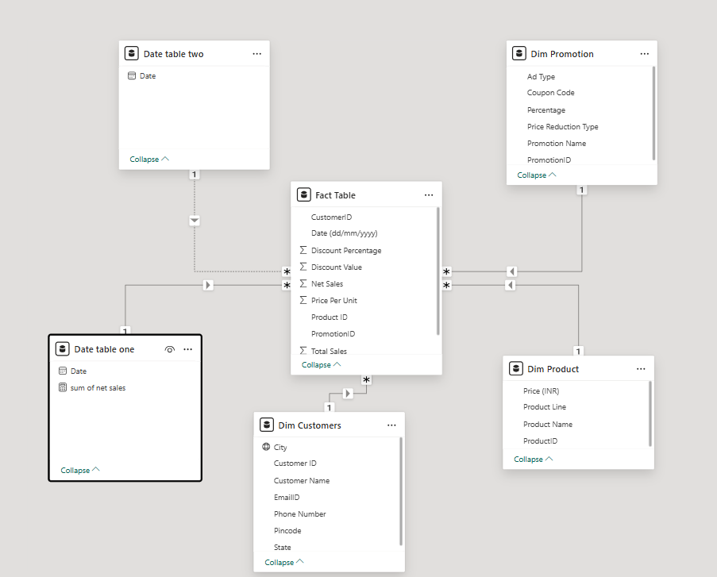

# 📊 Sales Analysis Dashboard – Power BI Project

This project presents a comprehensive **Sales Analysis Dashboard** created using **Power BI**. It analyzes store-level sales performance, identifying key metrics and business trends using interactive visuals.

---

## 📁 Files Included

- `Project.pbix` – Power BI Desktop file containing the full dashboard and data model.
- `Store Data.xlsx` – Excel dataset used as input.
- `SalesDashboard.pdf` *(optional)* – Exported PDF of the report for quick viewing.
- `dashboard_preview.png` *(optional)* – Screenshot of the dashboard visuals.

---

## 📌 Key Features

- **Interactive Dashboard** with slicers for store location and product category
- **KPIs:** Total Revenue, Average Profit, Units Sold, Top Categories
- **Trend Analysis** across months and store regions
- **Visuals Used:** Bar charts, line graphs, cards, tables, slicers
- **Data Modeling:** Loaded from Excel with star schema-based design
- **DAX Measures:** Used for custom calculations (e.g., total sales, % growth)

---

## 🛠️ Tools & Technologies

- Microsoft Power BI Desktop
- Microsoft Excel (as data source)
- DAX (Data Analysis Expressions)
- Power Query Editor

---

## 🧩 Dataset Description

The dataset (`Store Data.xlsx`) contains structured sales information:
- **Date**
- **Store ID / Name**
- **Product Category**
- **Units Sold**
- **Revenue**
- **Profit**

It enables time-series and categorical breakdown for detailed analysis.

---

## 📷 Dashboard Preview

*You can upload a screenshot as `dashboard_preview.png` and include it here like below:*

```markdown

